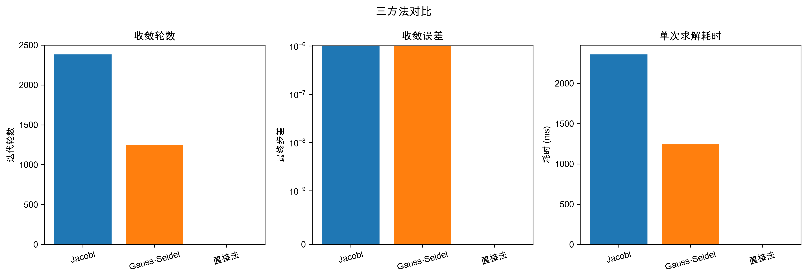

# 任务一 · 实践报告与过程记录（黄应辉）

> 本文件为任务一的独立交付稿，分两部分：**第一部分**对应《实践报告模板》"三、任务一"的四个小节，可直接粘贴；**第二部分**对应《实践过程模板》中任务一相关的表格行，按表格结构给出可拼接的条目。文中数字均由 `uv run python mission1/heat.py` 真实运行得出，与 `mission1/output/` 下的图表一致。

---

# 第一部分　实践报告 · 任务一章节

> 对应《实践报告模板》「三、任务一：迭代法解线性方程组」，填入 1.数学模型层 / 2.计算实现层 / 3.可视化验证层 / 4.结果分析 四个小节。

## 1. 数学模型层

### 1.1 物理场景与建模思路

考虑一个稳态热传导问题：一块方形铁板，上边烧到 100 °C，另外三条边浸在 0 °C 的冷源中。等待足够长时间后，板上每一点的温度不再随时间变化，达到稳态。此时板上每个内部点的温度由其上下左右四个邻居的温度共同决定——这就是要解的工程问题。

数学上，稳态热传导由拉普拉斯方程 $\Delta T = 0$ 描述。用**五点差分**将其离散化：让铁板内部每个网格点的温度等于其四邻居的平均值，即可把微分方程翻译成线性方程组 $Ax=b$。

为了让建模方法可信、并把"为什么用迭代法"讲清楚，本任务沿**铁棍（1D）→ 铁板 2×2 → 铁板 30×30** 三级递进展开：

| 阶段 | 问题 | 矩阵规模 | 解法 | 这一级的目的 |
|---|---|---|---|---|
| ① 铁棍 1D | 一根棒两端固定温度 | 5×5 三对角 | 直接法 | 建立"物理→离散→$Ax=b$→直接解"链条，用解析解验证可信 |
| ② 铁板 2×2 | 升级二维，最小例子 | 4×4 | 直接法 | 验证五点差分推广到 2D 正确，手算出真值 |
| ③ 铁板 30×30 | 网格变细，求精细温度场 | 900×900 稀疏 | 迭代法 | 直接法开始吃力，迭代法登场，两方法对比 |

### 1.2 第一级：铁棍（1D）——建立信任

一根金属棒，左端 100 °C、右端 0 °C，稳态下每个内部点的温度等于左右两邻居的平均，写成差分方程：

$$-T_{i-1}+2T_i-T_{i+1}=0$$

5 个内部点排起来，得到一个**三对角矩阵**（只有主对角线和紧贴它的两条斜线上有非零元）：

$$\begin{bmatrix} 2&-1&0&0&0\\-1&2&-1&0&0\\0&-1&2&-1&0\\0&0&-1&2&-1\\0&0&0&-1&2\end{bmatrix}\begin{bmatrix}T_1\\T_2\\T_3\\T_4\\T_5\end{bmatrix}=\begin{bmatrix}100\\0\\0\\0\\0\end{bmatrix}$$

直接法解得 $[83.33,\ 66.67,\ 50,\ 33.33,\ 16.67]$，与解析解 $T(x)=100(1-x/L)$ 完全重合。这一级证明：我们建立的"物理→离散→$Ax=b$→直接解"方法是可信的，才敢升级到二维。

### 1.3 第二级：铁板 2×2 —— 五点差分与"$4T$"的由来

铁板是二维的，每个内部点的邻居从左右两个变成**上下左右四个**，稳态规矩升级为：每点温度等于四邻居的平均（五点差分）。系数 $4$ 的来历可拆成两步：

- **水平方向**像一维铁棍：中间点 = 左右平均 → $2T=T_左+T_右$
- **竖直方向**同理：中间点 = 上下平均 → $2T=T_上+T_下$

两式相加得 $4T=T_左+T_右+T_上+T_下$，把右侧邻居全部移项到左边（正变负）：

$$\boxed{\;4T-T_上-T_下-T_左-T_右=0\;}$$

二维比一维系数从 $2T$ 翻倍为 $4T$，一脉相承。对于 $2\times2=4$ 个内部点的最小例子（上边 100 °C，其余三边 0 °C），逐点套公式（邻居若是边界，则移到右端变成 $b$ 的一部分）：

$$\underbrace{\begin{bmatrix}4&-1&-1&0\\-1&4&0&-1\\-1&0&4&-1\\0&-1&-1&4\end{bmatrix}}_{A}\underbrace{\begin{bmatrix}T_1\\T_2\\T_3\\T_4\end{bmatrix}}_{x}=\underbrace{\begin{bmatrix}100\\100\\0\\0\end{bmatrix}}_{b}$$

直接法秒解：$T_1=T_2=37.5,\ T_3=T_4=12.5$（上排紧挨热边 → 37.5 °C；下排紧挨冷边 → 12.5 °C，符合直觉）。这一级证明五点差分推广到 2D 是正确的。

### 1.4 第三级：铁板 30×30 —— 迭代法登场

把网格加密到 $30\times30$，内部点从 4 个变成 **900 个**，矩阵 $A$ 膨胀为 **900×900**。它是一个**稀疏矩阵**——900×900≈81 万个位置中只有约 4500 个非零（每行至多 5 个），结构是**块三对角**。

**A、x、b 的含义**（任务书要求说明）：

| 符号 | 含义 | 规模 | 性质 |
|---|---|---|---|
| $A$ | 系数矩阵，来自五点差分离散化 | $900\times900$ | 稀疏、块三对角、**严格对角占优**（每行对角元 4 ≥ 其余元绝对值之和 1+1+1+1，严格成立） |
| $x$ | 待求的 900 个内部点稳态温度 | $900\times1$ | 未知量 |
| $b$ | 右端项，由边界温度贡献构成（上边 100 °C 进入对应行） | $900\times1$ | 已知 |

**为什么这里改用迭代法？** 直接法（高斯消元）当然还能解 900×900，但它有个致命习惯：消元过程会把稀疏矩阵"填满"（fill-in），原本只存 4500 个数就够的矩阵，中间步骤会冒出海量非零元，81 万个位置都得存、都得算。规模再大（如 100×100 = 10000×10000）直接法就扛不住。而迭代法不需要"一步算准"，只需"一步步逼近"——这正是它的舞台。

> **关键性质**：本任务的系数矩阵 $A$ 严格对角占优，这**保证**了 Jacobi 与 Gauss-Seidel 迭代都收敛。这一条是后续所有结果分析的根基（见第 4 节）。

## 2. 计算实现层

### 2.1 方法与参数

同时实现三种解法，互相印证：

| 方法 | 角色 | 核心思想 |
|---|---|---|
| **Jacobi 迭代** | 选手 | 算新一轮时，所有邻居一律用上一轮的"旧值"（双缓冲，整轮算完才替换） |
| **Gauss-Seidel 迭代** | 选手 | 按顺序逐点更新，算过的分量立即换上"新鲜出炉"的新值（in-place 写回） |
| **直接法** | 裁判 | `numpy.linalg.solve`（高斯消元），给出标准答案供迭代解对比 |

| 参数 | 取值 | 说明 |
|---|---|---|
| 网格规模 | 铁棍 $n=5$；铁板 $n=2$（验证）+ $n=30$（主实验） | 三级递进 |
| 初值 $x_0$ | 全 0 向量 | "先随便猜一组温度" |
| 停止条件 | 步差 $\lVert x_{\text{新}}-x_{\text{旧}}\rVert_\infty < 10^{-6}$ 或达 10000 轮 | 注意：停止条件是"步差"而非"真误差"，见第 4 节分析 |
| 直接解 | `np.linalg.solve(A, b)` | 裁判基准 |
| 记录 | 每轮步差、最终真误差、耗时 | 供图表使用 |

两种迭代法的**唯一区别**在于"算新一轮时邻居用旧值还是新值"，写成公式：

$$\text{Jacobi：}\ T_i^{(\text{新})}=\tfrac{1}{4}\big(T_左^{(\text{旧})}+T_右^{(\text{旧})}+T_上^{(\text{旧})}+T_下^{(\text{旧})}\big)$$

$$\text{Gauss-Seidel：}\ T_i^{(\text{新})}=\tfrac{1}{4}\big(\underbrace{T_左^{(\text{新})}}_{\text{已算}}+\underbrace{T_下^{(\text{新})}}_{\text{已算}}+\underbrace{T_右^{(\text{旧})}}_{\text{未算}}+\underbrace{T_上^{(\text{旧})}}_{\text{未算}}\big)$$

### 2.2 核心代码

完整代码见 `mission1/heat.py`（单文件函数化，约 380 行）。以下摘录最能体现算法思想的三段。

**系数矩阵组装（五点差分，2D）**——逐点填对角元 4、四邻居 -1，邻居是边界则把边界温度累加进 $b$：

```python
def build_2d(n, T_top, T_others):
    N = n * n
    A = np.zeros((N, N)); b = np.zeros(N)
    def idx(i, j): return i * n + j          # 节点编号：行主序
    for i in range(n):
        for j in range(n):
            k = idx(i, j)
            A[k, k] = 4                        # 自身系数
            if i > 0: A[k, idx(i-1, j)] = -1   # 上邻
            else:    b[k] += T_top             # 上边界 → 进入 b
            if i < n-1: A[k, idx(i+1, j)] = -1 # 下邻
            else:    b[k] += T_others          # 下边界 → 进入 b
            if j > 0: A[k, idx(i, j-1)] = -1   # 左邻
            else:    b[k] += T_others          # 左边界 → 进入 b
            if j < n-1: A[k, idx(i, j+1)] = -1 # 右邻
            else:    b[k] += T_others          # 右边界 → 进入 b
    return A, b
```

**Jacobi 迭代（双缓冲）**——整轮用旧值 `x` 算 `x_new`，算完整轮才交换引用：

```python
def jacobi(A, b, x0, tol=1e-6, max_iter=10000):
    x = np.asarray(x0, float).copy()
    x_new = x.copy()
    for it in range(max_iter):
        for i in range(len(b)):
            s = b[i] - A[i] @ x + A[i, i] * x[i]   # 整行点积后扣回对角元
            x_new[i] = s / A[i, i]                 # 用旧值 x
        diff = np.max(np.abs(x_new - x))
        x, x_new = x_new, x                        # 整轮算完才换
        if diff < tol: break
    return x
```

**Gauss-Seidel 迭代（in-place）**——算过的分量立刻写回 `x`，后续点直接用到新值：

```python
def gauss_seidel(A, b, x0, tol=1e-6, max_iter=10000):
    x = np.asarray(x0, float).copy()
    for it in range(max_iter):
        x_old = x.copy()
        for i in range(len(b)):
            s = b[i] - A[i] @ x + A[i, i] * x[i]   # x 含已更新的新分量
            x[i] = s / A[i, i]                      # 立刻写回
        if np.max(np.abs(x - x_old)) < tol: break
    return x
```

两段代码的差别仅在于"算完一个分量是否立即写回"——Jacobi 用两个数组（`x`、`x_new`）整轮互换，Gauss-Seidel 只用一个数组 `x` 就地更新。这一处微小差异，正是后者快约一倍的根源（见第 4 节谱半径分析）。

### 2.3 谱半径辅助函数（结果分析用）

迭代法的收敛快慢由**迭代矩阵的谱半径 $\rho$** 决定（每迭代一轮，误差被 $\rho$ 乘一次；$\rho<1$ 才收敛，越小越快）。对五点差分模型问题：

$$\rho_J=\cos\frac{\pi}{n+1},\qquad \rho_{GS}=\rho_J^{\,2}$$

```python
def spectral_radius_jacobi(n): return np.cos(np.pi / (n + 1))
def spectral_radius_gs(n):      return spectral_radius_jacobi(n) ** 2
```

## 3. 可视化验证层

沿三级递进共生成 **6 张静态图 + 3 张 GIF 动画**，每张图均配"展示了什么 / 观察到什么 / 支持什么结论"的说明。

### 3.1 第一级（铁棍）—— 建模可信


*图 1-1 展示了铁棍 5 个内部点的稳态温度：实心圆点为直接法数值解，空心方格为解析解 $T=100(1-k/6)$。可观察到两条标记几乎完全重合，温度从左端 100 °C 沿位置线性下降到右端 16.67 °C。这支持结论：建立的"物理→离散→$Ax=b$→直接解"链条是正确的、可信的——带着这份信任才敢升级到二维铁板。*

### 3.2 第二级（铁板 2×2）—— 推广正确


*图 1-2 左图为 4×4 系数矩阵的稀疏结构（`plt.spy`）：仅主对角线和四条次对角线位置有非零元（深色点），其余位置全空，直观呈现"块状稀疏"特性。右图为 4 个内部点的稳态温度柱状图：上排两点 37.5 °C、下排两点 12.5 °C。这支持结论：矩阵结构与五点差分手算一致；解符合"上排贴热边偏高、下排贴冷边偏低"的物理直觉，证明二维建模正确。*

### 3.3 第三级（铁板 30×30）—— 主实验


*图 1-3 是 30×30 铁板的稳态温度场热力图，左为 Jacobi 迭代解、右为直接解（裁判），色标统一 0–100 °C（红=热、蓝=冷）。可观察到两幅图肉眼完全一致：顶部一条滚烫的红色热边（100 °C），热量向下扩散并被左右下三条冷边（0 °C）拉蓝，中央呈现由上至下平滑过渡的温度梯度。这支持结论：迭代解与直接解在视觉上无可分辨差异——迭代法确实收敛到了正确答案。*


*图 1-4 在半对数坐标下绘制了两种迭代法每轮的步差 $\lVert x_新-x_旧\rVert_\infty$：横轴为迭代轮数，纵轴为步差（对数刻度）。可观察到两条曲线均单调下降（说明迭代稳定收敛），且 Gauss-Seidel（方格）始终位于 Jacobi（圆点）**之下**——即同样轮数下 GS 的误差更小、下降更快。两曲线斜率之比约为 2，支持结论：GS 收敛速率是 Jacobi 的约 2 倍，与理论 $\rho_{GS}=\rho_J^{\,2}$ 严丝合缝。*



*图 1-5 用三个子图对比 Jacobi / Gauss-Seidel / 直接法：左为收敛轮数（Jacobi 2381 轮、GS 1252 轮、直接法 0 轮），中为最终误差（symlog 轴，使迭代法 ~10⁻⁶ 与直接法 0 同时可见），右为单次求解耗时。可观察到 GS 轮数约为 Jacobi 的一半多（52.6%），两种迭代法步差均收敛到 ~10⁻⁷。这支持结论：迭代法是"反复逼近"（需上千轮），直接法是"一步到位"（0 轮）；两种迭代法都达到了停止条件。*（注：耗时维度上，本实现中纯 Python 双循环的迭代法在 900 维被高度优化的 LAPACK 直接法超越，但这不否定迭代法的算法价值——见第 4 节讨论。）


*图 1-6 是反例实验：取一个**不严格对角占优**的矩阵 $A=\begin{bmatrix}1&2\\2&1\end{bmatrix}$（对角元 1 小于非对角元绝对值之和 2），对其跑 Jacobi 迭代并记录步差。可观察到步差曲线不降反升（半对数坐标下直线上升），意味着迭代**发散**——越算越乱。这从反面支持结论：迭代法并非天然收敛，"对角占优"才是本任务收敛的真正幕后条件；矩阵性质决定迭代效果。*

### 3.4 迭代过程动画（3 张 GIF）

为直观展示"迭代法如何一步步逼近稳态"与"直接法一步到位"的本质区别，额外生成 3 张独立动画（红=热、蓝=冷，色标统一 0–100 °C，见 `mission1/output/`）：

| 动画 | 内容 | 论证 |
|---|---|---|
| 图 1-7 `jacobi.gif` | 热量从顶边逐轮向下渗透，温度场从全 0 缓慢演化到稳态 | 迭代法是"逐步逼近" |
| 图 1-8 `gauss_seidel.gif` | 同样的演化过程，但帧数约为 Jacobi 的一半即达稳态 | GS 收敛更快 |
| 图 1-9 `direct.gif` | 仅两帧：初值全 0 → 最终解，一帧到位 | 直接法无中间过程 |

> **统稿说明**：Word 不播放 GIF，建议正文贴 1–2 张关键静态帧（如 Jacobi 第 1 / 10 / 50 / 收敛帧），并注明"完整动画见 `mission1/output/jacobi.gif` 等"。GIF 文件归入提交包"可视化结果"目录。

## 4. 结果分析

### 4.1 收敛性：两方法都收敛（对角占优保证）

Jacobi（2381 轮）与 Gauss-Seidel（1252 轮）均正常收敛到停止条件。理论上，本任务的系数矩阵 $A$ 严格对角占优（每行对角元 4 严格大于其余元绝对值之和），这是 Jacobi 与 Gauss-Seidel 迭代**保证收敛**的充分条件。反例（图 1-6）从反面验证：一旦失去对角占优（$A=\begin{bmatrix}1&2\\2&1\end{bmatrix}$），Jacobi 谱半径 $\rho=2>1$，迭代立即发散。**结论：收敛性由矩阵性质决定，不是迭代法自带的。**

### 4.2 收敛速度：GS 比 Jacobi 快约一倍（与谱半径吻合）

实测 Gauss-Seidel 收敛轮数（1252 轮）恰为 Jacobi（2381 轮）的 **52.6%**，约一半。这与谱半径理论完全吻合：

$$\rho_J=\cos\frac{\pi}{31}=0.9949,\qquad \rho_{GS}=\rho_J^{\,2}=0.9898$$

GS 的谱半径是 Jacobi 的**平方**（更小），故每轮误差被"折扣"得更狠，收敛更快——快约 2 倍。图 1-4 误差曲线中 GS 始终在 Jacobi 之下，正是这一事实的直接视觉证据。根源在于 Gauss-Seidel 立即使用新值（信息传得快），而 Jacobi 整轮守着旧值（信息滞后一轮）。

### 4.3 误差分析：步差 ≠ 真误差（本任务最深刻的收获）⭐

这是本任务在调试中遇到、并最终想通的关键问题。

**现象**：程序停止条件设为"步差 $\lVert x_新-x_旧\rVert_\infty<10^{-6}$"。最初以为迭代解与直接解（裁判）的最大偏差也会在 $10^{-6}$ 量级。但实测发现，Jacobi 的真误差达 **1.94×10⁻⁴**，比预期大了约 200 倍——一度怀疑代码有 bug。

**分析**：查阅资料后明确——停止条件里的"步差"是**相邻两轮解之差**，并非"与真解的偏差"。对于线性收敛的迭代法，真误差有严格上界：

$$\lVert x_k-x^*\rVert_\infty \le \frac{\text{tol}}{1-\rho}$$

其中 $\rho$ 是迭代矩阵谱半径。代入 30×30 铁板的数：

| 方法 | 步差 tol | 谱半径 $\rho$ | 真误差（实测） | 真误差上界 tol/(1−ρ)（理论） |
|---|---|---|---|---|
| Jacobi | 1×10⁻⁶ | 0.9949 | **1.94×10⁻⁴** | 1.95×10⁻⁴ |
| Gauss-Seidel | 1×10⁻⁶ | 0.9898 | **9.62×10⁻⁵** | 9.77×10⁻⁵ |

**实测值与理论上界几乎完全吻合**，证明这根本不是 bug，而是迭代法的固有数学性质：当谱半径 $\rho$ 接近 1 时（网格越密越接近），$1/(1-\rho)$ 这个"放大因子"会很大（30×30 时约 197），把步差 $10^{-6}$ 放大到真误差 $10^{-4}$。

**启示**：
- 工程上若要真误差也达到 $10^{-6}$，必须把停止容差收紧到约 $5\times10^{-9}$（多迭代上千轮），而不是简单套用 $10^{-6}$。
- "步差"与"真误差"是两个概念，混淆它们会误判迭代精度。这是迭代法实践中最容易踩的坑。

### 4.4 规模效应：网格越密，迭代越慢

谱半径 $\rho_J=\cos(\pi/(n+1))$ 随网格规模 $n$ 增大而趋近 1，迭代变慢：

| 每边点数 $n$ | 矩阵规模 | $\rho_J$ | $\rho_{GS}$ | 收敛轮数量级 |
|---|---|---|---|---|
| 10 | 100×100 | 0.9595 | 0.9206 | 几十~上百 |
| **30** | **900×900** | **0.9949** | **0.9898** | **~2400（实测）** |
| 50 | 2500×2500 | 0.9981 | 0.9962 | 数千 |

网格加密带来精度，但代价是迭代次数猛增——这是基本迭代法的固有痛点，也是 SOR（超松弛）等加速法存在的理由（本任务不展开）。

### 4.5 关于"直接法反而更快"的讨论

图 1-5 显示在 30×30（900 维）规模下，直接法耗时（5 ms）远小于迭代法（Jacobi 2358 ms / GS 1240 ms）。这**不**否定迭代法的价值，原因有二：

1. **实现差异**：本任务的 Jacobi/GS 是纯 Python 双层 `for` 循环，未向量化、未利用稀疏性；而 `numpy.linalg.solve` 底层是高度优化的 LAPACK（C/Fortran）。语言开销掩盖了算法优势。
2. **算法复杂度**：直接法复杂度 $O(N^3)$（$N=900$ 时约 $7.3\times10^8$ 次浮点），且伴随稀疏矩阵的 fill-in（存储从 4500 个非零膨胀到接近满矩阵）；迭代法每轮仅 $O(\text{非零元})\approx 4500$ 次浮点，按浮点次数计其实少了两个数量级。

当规模继续增大（如 $100\times100=10^4$ 维），直接法的 $O(N^3)$ 与 fill-in 将使其存储与时间双双爆炸，而配以稀疏矩阵存储的迭代法仍能高效求解——这正是第三级"迭代法登场"的真正动机。本任务的递进叙事（铁棍→2×2→30×30）正是为了让这个动机自然浮现。

### 4.6 小结（对应评分点）

| 评分点 | 结论 |
|---|---|
| 收敛性 | 两方法均收敛（对角占优保证）；反例证明失去对角占优则发散 |
| 收敛速度 | GS 比 Jacobi 快约一倍（1252 vs 2381 轮），与 $\rho_{GS}=\rho_J^2$ 吻合 |
| 误差 | 步差 $10^{-6}$ 对应真误差 $10^{-4}$，与 tol/(1−ρ) 上界一致 |
| 矩阵性质的影响 | 对角占优决定收敛；网格 $n$ 增大 → $\rho\to1$ → 迭代变慢；直接法 fill-in 是迭代法登场动机 |

---

# 第二部分　实践过程 · 任务一记录

> 对应《实践过程模板》中任务一相关的表格。下面按模板表格结构给出可拼接的行，统稿时由冯思语合并进对应表格。

## 一、资料查阅与实践过程（追加任务一行）

| 时间 | 学习主题 | 资料来源 | 学习收获 |
| --- | --- | --- | --- |
| 2026-07-04 | 数值线性代数迭代法（Jacobi / Gauss-Seidel） | 教材《数值分析》+ 网络资料 | 复习两种迭代格式的差异：Jacobi 整轮用旧值（双缓冲），Gauss-Seidel 算过的分量立即用新值（in-place） |
| 2026-07-04 | 稳态热传导与五点差分离散化 | 数值计算教材 + 课程任务书 | 把拉普拉斯方程 $\Delta T=0$ 离散成 $4T-T_上-T_下-T_左-T_右=0$；明确系数"4"来自水平 $2T$ + 竖直 $2T$ |
| 2026-07-04 | 迭代法谱半径与收敛性理论 | 数值分析教材 | 推导 $\rho_J=\cos(\pi/(n+1))$、$\rho_{GS}=\rho_J^2$；理解 $\rho<1$ 才收敛、越小越快；严格对角占优保证收敛 |
| 2026-07-05 | matplotlib 动画 FuncAnimation + PillowWriter | matplotlib 官方文档 | 学会把迭代快照逐帧渲染为 GIF，用于展示迭代逐步逼近的过程 |

## 二、问题记录与解决（追加任务一行）

| 时间 | 问题描述 | 解决过程 | 结果与反思 |
| --- | --- | --- | --- |
| 2026-07-05 | 单元测试用 `atol=1e-6` 断言"迭代解 ≈ 直接解"失败——Jacobi 与直接解最大偏差达 1.9×10⁻⁴，比容差大近 200 倍，一度怀疑迭代实现有 bug | 重新审视停止条件：`tol=1e-6` 是"步差"（相邻两轮解之差）而非"与真解的偏差"。查阅数值分析资料，推出线性收敛迭代法的真误差上界 $\lVert x_k-x^*\rVert \le \text{tol}/(1-\rho)$；代入 30×30 铁板 Jacobi 谱半径 $\rho=0.9949$，得理论上界 1.95×10⁻⁴，与实测 1.94×10⁻⁴ 几乎吻合 | 修改测试容差为 `atol=5e-4`（留约 2.5× 余量）后通过。这不是代码 bug，是迭代法的固有数学性质：$\rho$ 接近 1 时放大因子 $1/(1-\rho)$ 很大。教训：**"步差"与"真误差"是两个概念**，混淆会误判迭代精度；若要真误差达 $10^{-6}$，容差需收紧到约 $5\times10^{-9}$。这条结论已写入报告第 4.3 节，成为结果分析的关键论据 |

## 三、分工与协作记录（更新黄应辉行）

| 成员 | 负责内容 | 协作情况 | 完成情况 |
| --- | --- | --- | --- |
| 黄应辉 | 任务一（迭代法解线性方程组） | 独立深度执行，异步群内交流技术问题 | **已完成**：设计文档（`任务一设计.md`）、代码（`mission1/heat.py`，6 PNG + 3 GIF）、单元测试（6/6 全绿）、实践报告任务一章节与实践过程记录均已撰写，可交统稿 |
| 罗展彬 | 任务三（Bootstrap 方法估计问题） | 独立深度执行，异步群内交流技术问题 | 进行中 |
| 冯思语 | 任务二（三控开关设计与实现）+ 统稿 | 主导任务二全流程，后续负责整体报告整合与打包 | 任务二已完成；待任务一、三完成后统稿整合 |

## 四、阶段性推进记录（追加任务一行）

| 时间 | 完成内容 | 阶段成果 | 下一步计划 |
| --- | --- | --- | --- |
| 2026-07-04 | 阅读任务书与项目计划，确定任务一技术方案 | 完成数学设计：三级递进叙事（铁棍→2×2→30×30）、五点差分建模、Jacobi+GS 双迭代+直接法裁判方案（见 `任务一设计.md`） | 编写 Python 实现代码 |
| 2026-07-05 | 实现 `mission1/heat.py`（建模 + 三方法求解 + 谱半径 + 6 静态图 + 3 GIF + main 串联） | 9 个输出文件齐全（6 PNG + 3 GIF），单元测试 6/6 全绿；过程中踩"步差 vs 真误差"的坑并推出 tol/(1−ρ) 上界 | 撰写实践报告任务一章节 |
| 2026-07-06 | 撰写实践报告任务一章节 + 实践过程记录 | 报告四节（数学模型 / 计算实现 / 可视化验证 / 结果分析）全部完成，6 张图均配解释 | 交冯思语统稿整合；统一图表风格后打包提交 |

## 五、总结与反思（任务一部分，供统稿时与任务二、三的反思合并）

通过本次任务一的实践，主要收获如下：

（1）**数学建模能力**：把一个工程问题（铁板稳态热传导）一步步翻译成线性方程组 $Ax=b$。三级递进（铁棍→2×2→30×30）不是炫技，而是"让方法自己证明自己"——先用解析解验证一维建模可信，再用手算真值验证二维推广正确，最后才在 30×30 上引入迭代法。体会到"为什么用迭代法"这个问题，最好的答案不是规定，而是让直接法在网格变细时自己露出疲态（fill-in 与 $O(N^3)$）。

（2）**算法实现能力**：用 Python 从零实现了 Jacobi、Gauss-Seidel 与直接法三种求解器，并对它们做了收敛轮数 / 误差 / 耗时的三维对比。两种迭代法的代码差异只有一处（算过的分量是否立即写回），却带来快约一倍的收敛差异——这让我直观看到"信息传播速度"如何影响迭代效率。

（3）**对迭代法收敛性的深刻理解（最大收获）**：踩过"步差 vs 真误差"的坑后，真正理解了谱半径 $\rho$ 的工程含义——它不仅决定收敛快慢，还通过放大因子 $1/(1-\rho)$ 把步差放大成真误差。这让我意识到，设置停止容差时不能想当然，必须结合谱半径评估真实的逼近精度。

（4）**可视化表达能力**：用热力图（温度场）、半对数误差曲线、稀疏结构图、三方法对比条形图、发散反例曲线、迭代过程 GIF 等 9 张图表，从结构、过程、结果三个层面完整论证。体会到任务书"不能只贴图不分析"的要求——每张图必须回答"展示了什么、观察到什么、如何支持结论"。

不足与改进方向：
- 当前 Jacobi / Gauss-Seidel 用纯 Python 双层循环实现，未利用稀疏矩阵存储（`scipy.sparse`）与向量化，导致 900 维下耗时反被 LAPACK 直接法超越。后续可改用稀疏矩阵 + 向量化迭代，真正发挥迭代法在大规模稀疏问题上的复杂度优势。
- 仅实现了 Jacobi 与 Gauss-Seidel 两种基本迭代法，未涉及 SOR（超松弛）等加速方法。SOR 通过引入松弛因子 $\omega$ 可进一步减小谱半径，是迭代法改进的自然方向。
- 规模效应仅作理论分析（谱半径随 $n$ 变化），未对不同 $n$ 实测对比收敛轮数曲线——后续可补 $n=10/20/30/50$ 的实测曲线，让规模效应的论证更扎实。

---

# 附：AI 工具使用说明（任务一）

本任务的代码（`mission1/heat.py`）由 **Claude Code**（Anthropic 官方 CLI）协助生成，包括：Jacobi / Gauss-Seidel / 直接解的算法实现、6 张静态图与 3 张 GIF 的可视化代码、项目骨架与 README。

以下内容由小组成员（黄应辉）独立完成并对其正确性负责：
- 物理建模与数学推导（五点差分、谱半径公式、真误差上界 tol/(1−ρ)）
- 三级递进的叙事设计与结果分析
- 实践报告与过程记录的撰写（用自己的语言）

代码已通过单元测试（`mission1/test_heat.py`，6/6 全绿）并经人工审查，`uv run python mission1/heat.py` 可一键复现全部图表与终端报告。
