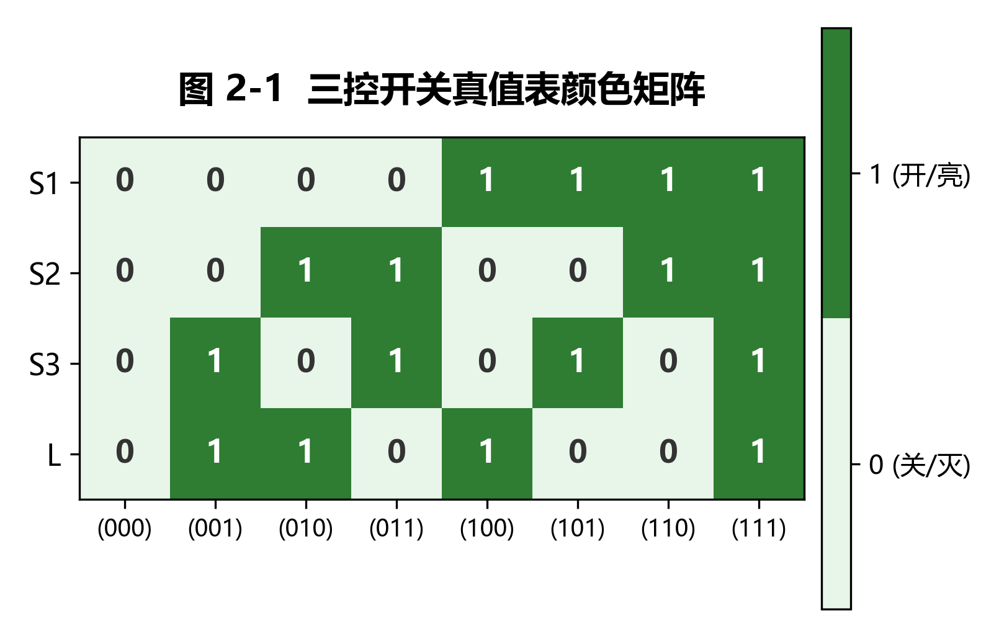
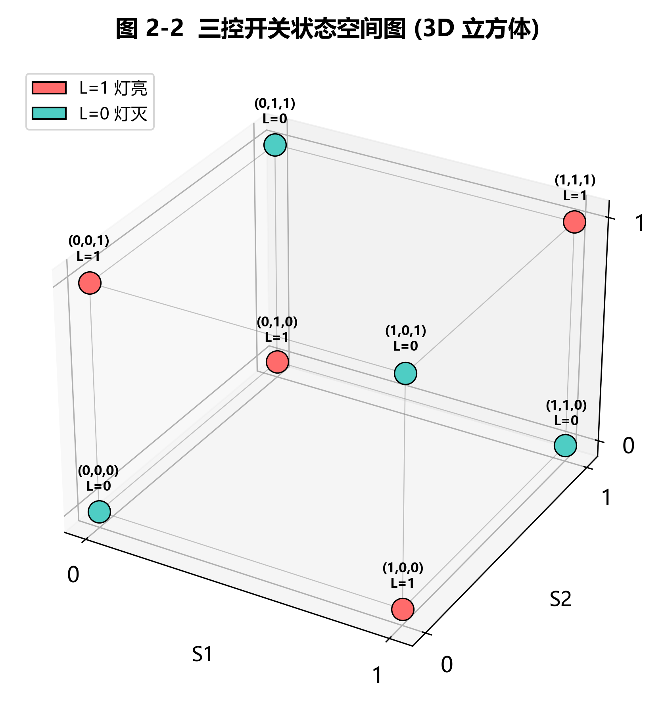
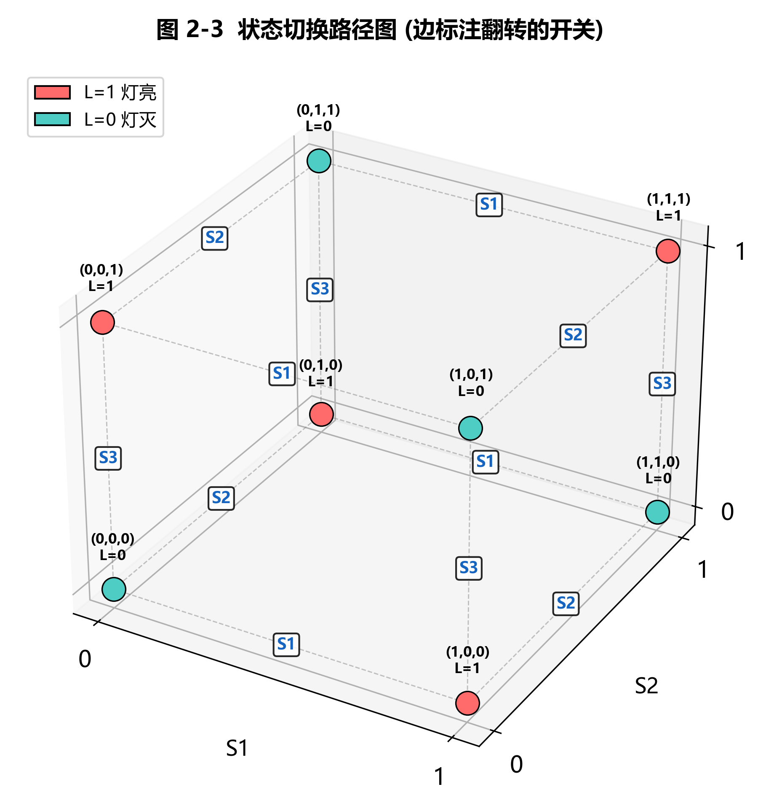
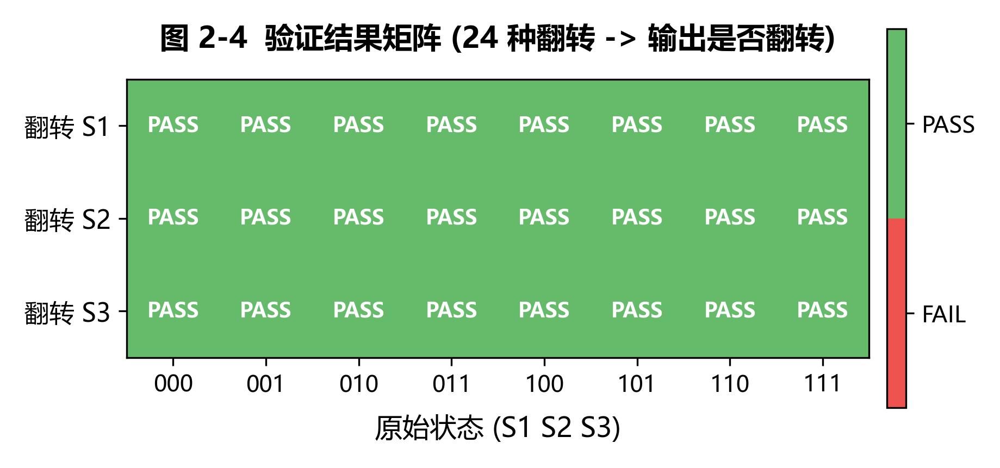

《数学思维实践》课程 CDIO二级项目实践报告模板

学生填写版

课程代码：CST4822A 课程名称：数学思维实践 版本：2026年6月

# 一、基本信息

| 项目 | 填写内容 |
| --- | --- |
| 项目名称 |  |
| 组号 |  |
| 项目成员 |  |
| 提交日期 |  |

# 二、摘要

简要说明本次实践完成的主要内容、使用的数学方法、实现工具、主要结果和结论。建议200-300字。

【在此填写摘要】

# 三、任务一：迭代法解线性方程组

## 1. 数学模型层

说明Ax=b中A、x、b的含义，给出矩阵、向量和建模假设。

【在此填写】

## 2. 计算实现层

说明使用的迭代方法、初值、误差阈值、停止条件和核心算法步骤。

【在此填写】

## 3. 可视化验证层

插入矩阵结构图、迭代误差曲线、结果对比图等图表。

【在此填写】

## 4. 结果分析

分析收敛性、误差、不同方法差异及原因。

【在此填写】

# 四、任务二：三控开关的设计与实现

## 1. 状态与逻辑建模

三控开关系统包含三个二值开关 S1、S2、S3 ∈ {0, 1}（0 表示关闭，1 表示打开）和一个灯 L ∈ {0, 1}（0 表示灯灭，1 表示灯亮）。设计要求为：任意拨动一个开关，灯的状态必须改变。

对三个开关，全部可能的输入组合共有 2³ = 8 种。枚举所有状态并依据设计要求推导 L 的值，得到如下真值表：

| S1 | S2 | S3 | L |
|----|----|----|---|
| 0  | 0  | 0  | 0 |
| 0  | 0  | 1  | 1 |
| 0  | 1  | 0  | 1 |
| 0  | 1  | 1  | 0 |
| 1  | 0  | 0  | 1 |
| 1  | 0  | 1  | 0 |
| 1  | 1  | 0  | 0 |
| 1  | 1  | 1  | 1 |

观察真值表可知，L 的输出恰为 S1、S2、S3 的异或（XOR）运算结果。因此布尔逻辑表达式为：

$$L = S1 \oplus S2 \oplus S3$$

该表达式的物理意义可解释为：当三个开关中被按下的个数为奇数时，灯亮；为偶数时，灯灭。异或运算的性质保证了任意一个输入位翻转时，输出必然翻转——这正是三控开关的核心设计原理。

真值表颜色矩阵见图 2-1，状态空间的三维立方体表示见图 2-2。



*图 2-1 展示了 8 种开关组合下 S1、S2、S3 和 L 的取值分布。绿色表示 1（开/亮），浅绿表示 0（关/灭）。可以直观看到 L 的值恰好等于三个开关值之和的奇偶性。*



*图 2-2 以三维立方体的 8 个顶点表示全部状态空间，(S1, S2, S3) 为坐标。红色顶点表示 L=1（灯亮），青色顶点表示 L=0（灯灭）。立方体棱连接哈密顿距离为 1 的状态对，即只差一个开关取值的相邻状态。沿任意一条棱移动恰好对应"拨动一个开关"。*

## 2. 计算实现

程序使用 Python 3 编写，仅依赖标准库 `itertools`（枚举状态组合）以及 `numpy`、`matplotlib` 用于可视化和数据处理。程序包含三个核心功能模块：

**真值表生成**：利用 `itertools.product([0,1], repeat=3)` 自动枚举 8 种开关组合，对每一种组合计算 L = S1 ^ S2 ^ S3（Python 中 `^` 为异或运算符），并以格式对齐的表格形式输出到控制台。

**交互式输入输出**：提供命令行交互界面，用户输入三个 0 或 1 的值（空格分隔），程序输出对应灯的状态。包含输入校验功能（检查输入数量、是否整数、是否在 {0,1} 范围内），输入 `q` 退出交互。

**自动验证模块**：对全部 8 种初始状态，逐一翻转 S1、S2、S3（共 8 × 3 = 24 种情况），检查翻转前后 L 是否发生变化。验证逻辑：若 L_before ≠ L_after，则该次翻转测试通过。程序自动统计通过率并逐条打印结果。本次运行结果：24 种翻转情况全部 PASS，验证通过率 100%。

**交互式演示网页**：为进一步直观展示三控开关的实时工作过程，额外编写了一个自包含 HTML 页面 `task2/interactive_switch.html`。双击浏览器即可打开，无需任何依赖。页面提供：三个可点击开关（横向排列，点击切换 0/1）、灯的实时发光效果（亮=金色光晕，灭=暗灰色）、公式区实时显示通用公式 → 代入值 → 逐步分解计算全过程、真值表当前行黄色高亮。

核心代码结构如下（完整代码见 `task2/three_switch.py`）：

```python
def switch_logic(s1, s2, s3):
    return s1 ^ s2 ^ s3  # 三异或

def generate_truth_table():
    return [(s1, s2, s3, switch_logic(s1, s2, s3))
            for s1, s2, s3 in itertools.product([0, 1], repeat=3)]

def auto_verify():
    for s1, s2, s3, L in truth_table:
        for flip_idx, switch_name in enumerate(["S1","S2","S3"]):
            flipped = [s1, s2, s3]; flipped[flip_idx] ^= 1
            assert L != switch_logic(*flipped)  # 必须翻转
```

## 3. 可视化验证

可视化部分共生成四张图表，分别从结构、过程和结果三个角度展示三控开关的逻辑特性。


*图 2-1（结构可视化）：以 8×4 颜色矩阵呈现真值表。行对应变量 S1/S2/S3/L，列对应 8 种输入组合。绿色格子为 1（开/亮），浅绿为 0（关/灭）。一目了然地展示了 L 与三个开关取值的对应规律——L 列恰好是 S1、S2、S3 三列之和的奇偶性。*


*图 2-2（结构可视化）：将全部 8 种开关状态映射到三维立方体的顶点，(S1, S2, S3) 作为坐标。红色顶点（灯亮）和青色顶点（灯灭）在立方体对角交替分布，体现了异或函数的对称性。立方体的 12 条棱代表仅改变一个开关取值的相邻状态对。*



*图 2-3（过程可视化）：在图 2-2 的基础上，在每条棱的中点标注了该边所对应的翻转开关（S1/S2/S3）。沿立方体棱移动即模拟"拨动一个开关"，从红色顶点出发必抵达青色顶点，反之亦然——这直观证明了"任一开关翻转必导致灯状态变化"。*



*图 2-4（结果可视化）：以 3 行 × 8 列热力图汇总全部 24 种翻转验证结果。行对应被翻转的开关（S1/S2/S3），列对应 8 种原始输入状态。全部格子显示绿色 PASS，表明 24 种翻转均成功引起输出变化，验证通过率 100%。*

上述四张图从不同层次完整验证了三控开关设计的正确性：真值表定义了输入输出映射，状态空间图展示了状态间的拓扑关系，切换路径图说明了状态转换机制，验证矩阵给出了量化的正确性结论。

此外，还开发了基于 HTML 的交互式演示页面（`task2/interactive_switch.html`），可在浏览器中实时操作：点击三个开关按钮切换 0/1 状态，灯和公式同步更新。页面中公式区域呈现三层计算过程——通用布尔表达式 → 具体数值代入 → 逐步分解计算（如 L = (0⊕1)⊕0 = 1⊕0 = 1），实现了从理论公式到实时交互的自然过渡。该页面可作为课堂演示或答辩展示使用，运行截图可在附录中查看。

## 4. 结果分析

（1）**设计要求满足情况**：24 种翻转验证全部通过，证明对于任意初始状态，翻转任意一个开关，灯的状态必然改变。三控开关的设计目标——"任一开关变化 → 输出变化"——被 L = S1 ⊕ S2 ⊕ S3 完美实现。

（2）**布尔表达式的简洁性**：L = S1 ⊕ S2 ⊕ S3 是三控开关的最简表达式。若展开为与或式，为 L = S1·~S2·~S3 + ~S1·S2·~S3 + ~S1·~S2·S3 + S1·S2·S3（四项三变量乘积项之和），远不如异或表达简洁。异或运算天然满足"每位翻转则整体翻转"的性质，因此是该设计问题的最优解。

（3）**程序输出与真值表一致性**：程序生成的真值表与手工推导完全一致，程序中的自动验证覆盖了全部 24 种翻转路径且全部通过。交互模式允许实时测试任意输入组合，输出与真值表预期吻合。

（4）**局限性讨论**：本设计基于理想二值开关假设，未考虑实际电路中开关抖动（bounce）、信号延迟等物理因素。若扩展到实际硬件实现（如继电器或数字逻辑电路），需额外考虑去抖动电路和门延迟。此外，三控开关可推广至 n 控开关（n 为奇数时逻辑为 n 位异或），偶数个开关则无法满足"任一变化则输出变化"的要求。

# 五、任务三：采用Bootstrap方法解决估计问题

## 1. 估计问题与数据说明

说明样本数据来源、统计量、估计目标和基本假设。

【在此填写】

## 2. Bootstrap方法实现

说明重采样次数、每次采样大小、统计量计算方法和核心代码思路。

【在此填写】

## 3. 可视化验证

插入原始分布、重采样分布、置信区间等图表。

【在此填写】

## 4. 结果分析

解释点估计、置信区间、估计稳定性和方法局限。

【在此填写】

# 六、综合讨论

从工程建模、数学方法、计算实现、可视化表达四个角度总结三个任务之间的联系。

【在此填写】

# 七、总结与改进

总结本次实践的主要收获、不足以及可以进一步改进的方向。

【在此填写】

# 八、参考资料

列出使用的教材、文献、网页资料、开源代码或AI工具辅助情况。

【在此填写】

# 九、附录

可附核心代码、完整数据说明、额外图表、运行说明等。

【在此填写】