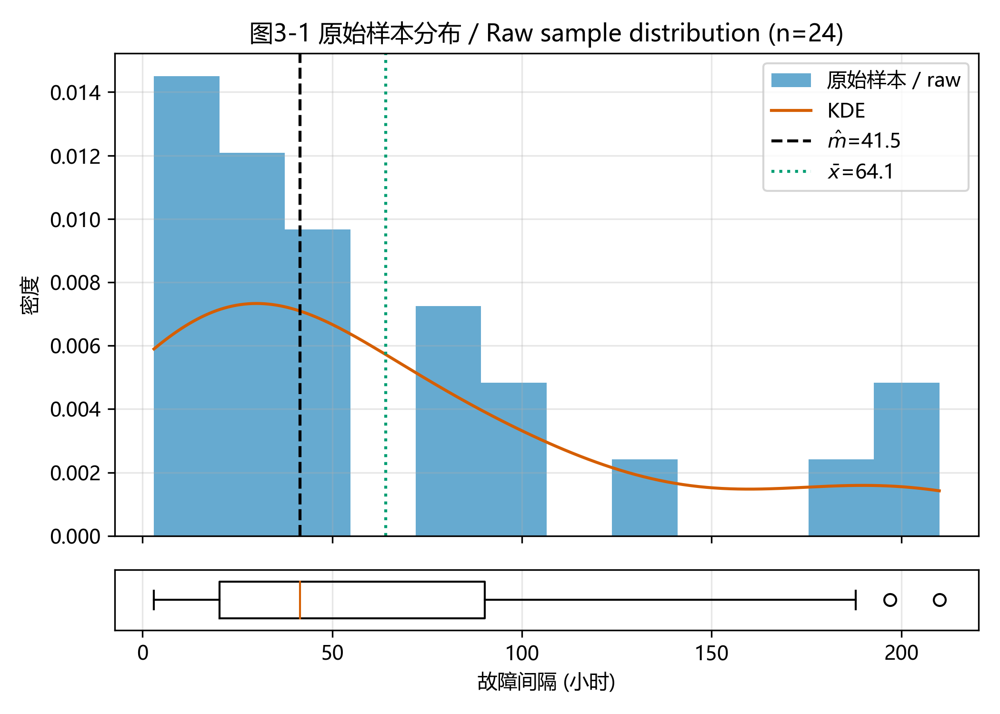
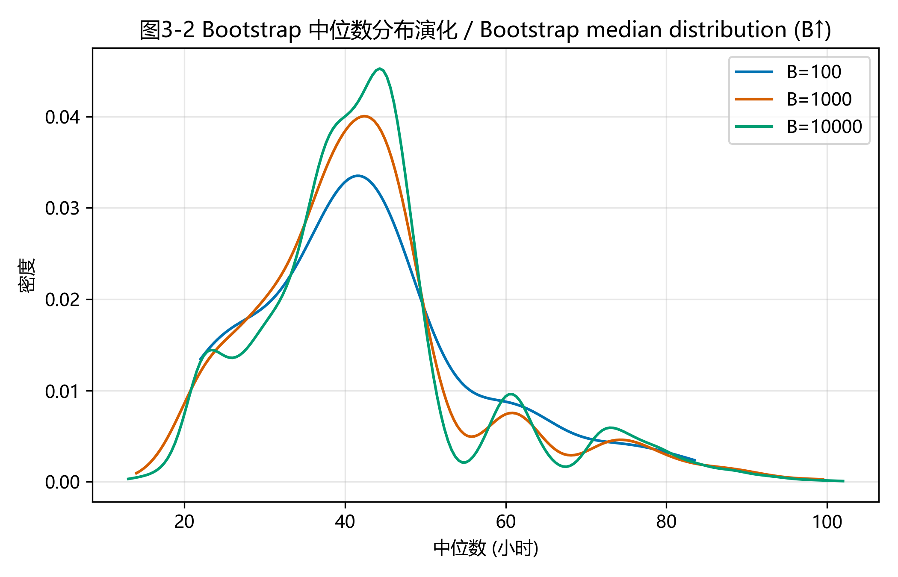
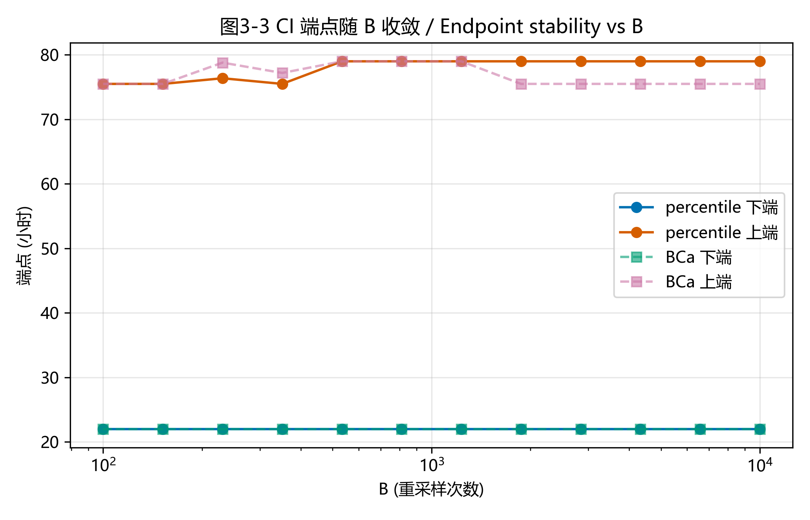
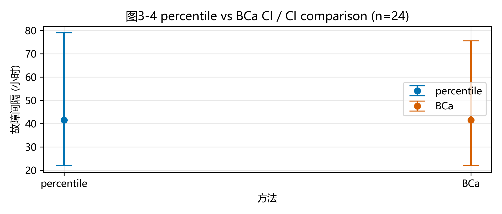
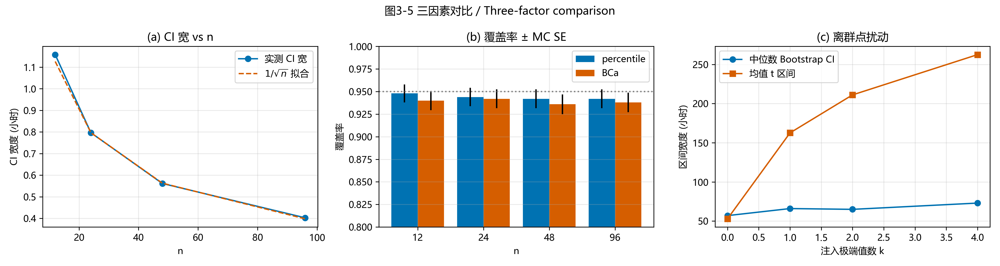

# 任务三实践报告：采用 Bootstrap 方法估计总体中位数

> 课程：数学思维实践（CST4822A）· CDIO 二级项目 · 任务三
> 学科：概率论与数理统计实验（满分 15）
> 本文件：**任务三**的实践报告章节，待与任务一、二合并入正式《实践报告》（对应报告模板第五部分「五、任务三」）。
> 统一采用「数学模型层 → 计算实现层 → 可视化验证层」三层结构。

---

## 基本信息（任务三部分）

| 项目 | 填写内容 |
| --- | --- |
| 项目名称 | 数学思维实践 CDIO 二级项目 · 任务三 |
| 组号 | 【待小组填写】 |
| 项目成员 | 罗展彬（主导）、黄应辉、冯思语 |
| 提交日期 | 【待小组填写】 |

---

## 摘要（任务三）

本任务针对「估计一批右偏寿命数据的总体中位数」这一**没有闭式置信区间**的估计问题，采用**非参数 Bootstrap** 方法求解。以 Proschan (1963) 波音 720 第 7 架机空调故障间隔数据（`aircondit7`，$n=24$）为真实样本，对总体中位数 $m$ 进行点估计与区间估计：以 **percentile 法为主、BCa 法为对照**，给出 95% 置信区间，并用指数分布 $\text{Exp}(1)$（真中位数 $\ln 2$ 已知）做覆盖率实验自证方法可信。实现工具为 Python（`numpy`/`scipy`/`matplotlib`），计算核心为纯函数化的 `bootstrap_core.py`，并辅以 Streamlit 交互仪表盘。主要结果：点估计 $\hat m=41.5$ h，Bootstrap 标准误 $\widehat{\mathrm{SE}}^{*}=13.89$ h，percentile 95% CI $=[22.0,79.0]$，BCa 95% CI $=[22.0,75.5]$；Exp(1) 覆盖率实测 percentile $0.934\pm0.0079$、BCa $0.928\pm0.0082$。结论：Bootstrap 在中位数等无闭式区间的统计量上给出了光滑、可解释的区间估计；同时实测发现中位数（非光滑泛函、偶数 $n$）下 BCa 的加速度 $\hat a\equiv0$ 而**退化为 percentile + 偏差修正**，这一局限性已在报告中如实说明。

---

# 五、任务三：采用 Bootstrap 方法解决估计问题

## 1. 估计问题与数据说明

### 1.1 估计问题

本任务要解决的估计问题是：**根据一组右偏的小样本寿命数据，估计总体的「典型」故障间隔，并给出其不确定性（置信区间）**。

故障间隔这类数据通常呈右偏分布（少量极长间隔把右侧尾巴拉长），此时**均值会被右尾抬高、不再代表「典型」水平**，而**中位数**（一半数据之下、一半之上）更稳健、更贴近「典型故障间隔」的含义。因此本任务选择**估计总体中位数 $m$**，而非均值。

需要强调的是：中位数是任务书所列四个候选统计量（均值、中位数、比例、两样本均值差）中**最应当用 Bootstrap** 的一个——其理由见 §1.5，这是本任务方法选择的核心论证。

### 1.2 数据来源与可复现性

**真实样本**采用 Proschan (1963) 发表于 *Technometrics* 的波音 720 空调故障间隔数据集中的**第 7 架机**子集（R `boot` 包命名为 `aircondit7`，可通过 `library(boot); data(aircondit7)` 一行加载复现）。原始论文：

> Proschan, F. (1963). *Theoretical Explanation of Observed Decreasing Failure Rate*. **Technometrics**, 5(3), 375–383.

样本量为 $n=24$，单位为服务小时，24 个观测值（已按从小到大排序）为：

$$x=(3,5,5,13,14,15,22,22,23,30,36,39,44,46,50,72,79,88,97,102,139,188,197,210)$$

核验后的样本摘要（`numpy`，标准差用 `ddof=1`，与 R `sd()` 口径一致）：

| 统计量 | 值 | 解读 |
|---|---|---|
| 样本量 $n$ | 24 | 小样本 |
| 中位数 $\hat m$ | 41.5 h | 约一半故障早于此 |
| 均值 $\bar x$ | 64.12 h | $\bar x>\hat m$ |
| 样本标准差 $s$ | 62.65 h | 离散度大 |
| 极差 | $[3,\ 210]$ | 无异常极小值 |
| $\bar x/\hat m$ | 1.55 | **明显右偏** → 中位数更稳健 |

均值比中位数高出 55%，直观说明分布右偏、均值被少数长间隔（如 188、197、210 h）抬高——这正是选用中位数的现实动机。

> **为何 $n=24$ 恰到好处（小样本是优点而非缺陷）**：大样本下中位数近乎已知（不确定度极小），「估计问题」反而消失；$n=24$ 时不确定性真实存在，Bootstrap 才有意义——**数据越少、越偏离正态，越需要 Bootstrap**。同时小样本 + 强右偏使均值的 $t$ 区间正态假设失效，而 Bootstrap 非参数、不假设分布族，恰好胜任。此外，`aircondit7`（第 7 架机，$n=24$）与同源的 `aircondit`（第 9 架机，$n=12$）是两架不同飞机、失效率不同，**不能靠合并来凑样本量**——Proschan (1963) 的核心论点正是「各架机失效率有差异」，合并会违反 i.i.d. 并人为制造伪下降失效率。因此 $n=24$ 是该架机的合法全部数据。两本 Bootstrap 经典教科书（Efron & Tibshirani 1993；Davison & Hinkley 1997）也均刻意选小数据配 Bootstrap，与本任务选择一致。

**对照模拟**：为「自证」所用 Bootstrap 方法确实能覆盖真值，另取 $X_i\sim\text{Exp}(1)$（指数分布，尺度参数 1），其总体中位数 $m=\ln 2\approx 0.6931$ **解析已知**。在该模拟上跑同一套 Bootstrap 算法、检查 95% 置信区间是否覆盖 $\ln 2$，即可在不依赖真实数据真值的前提下验证方法的可信度。

### 1.3 统计量与估计目标

| 项 | 定义 | 本例取值 |
|---|---|---|
| 总体中位数 $m$ | 满足 $F(m)=0.5$ 的值（$F$ 为总体累积分布函数） | 真实数据未知；$\text{Exp}(1)$ 下 $m=\ln 2\approx0.6931$ |
| 样本中位数 $\hat m$ | 偶数 $n$ 下取第 $n/2$ 与 $n/2+1$ 个顺序统计量的均值 | `aircondit7`：$\hat m=(39+44)/2=41.5$ h |
| 估计目标 | 用 $\hat m$ 推断 $m$，并给出 95% 置信区间 | $\hat m\ +\ $95% CI |

### 1.4 基本假设

- $x_1,\dots,x_n$ **独立同分布**，来自某未知分布 $F$（非参数，**不假设** $F$ 属于任何参数族，如正态、指数）；
- $F$ 在 $m$ 处**连续且密度 $f(m)>0$**（保证总体中位数唯一、样本中位数渐近正态）。

### 1.5 为何选中位数 + Bootstrap（方法选择核心论证）

中位数的**渐近标准误依赖未知密度** $f(m)$：

$$\sqrt{n}\,(\hat m-m)\xrightarrow{d}N\!\left(0,\ \frac{1}{4f(m)^2}\right),\qquad \widehat{\mathrm{SE}}(\hat m)\approx\frac{1}{2f(m)\sqrt{n}}$$

而任务书另外三个候选统计量都有**不依赖任何未知量**的闭式区间：

| 统计量 | 闭式 95% CI | 是否需估计未知量 |
|---|---|---|
| 均值 | $\bar x\pm t_{\alpha/2,n-1}\,s/\sqrt{n}$ | 否 |
| 比例 | Clopper–Pearson / Wilson | 否 |
| 两样本均值差 | Welch $t$（Satterthwaite 自由度） | 否 |
| **中位数** | 需先估计 $f(m)$（核密度），实操几乎无人采用 | **是** |

也就是说：均值、比例、两样本均值差都有现成的闭式区间，用 Bootstrap 反而是「多此一举」；**唯独中位数的标准误卡在未知密度 $f(m)$ 上，没有简单可用的闭式区间**——Bootstrap 通过重采样「用样本自身模拟抽样分布」，绕开了对 $f(m)$ 的估计，恰好补上这块空白。这正是任务书「说明 Bootstrap 方法适合该问题的原因」这一评分点的答案。

> **学术诚实补注**（防止对方法理解不到位）：中位数并非「完全没有」非 Bootstrap 区间——基于顺序统计量 / 符号检验的精确区间 $(X_{(k)},X_{(n-k+1)})$ 不需要 $f(m)$，但它**只能取离散的覆盖水平**（给定 $n$ 永远凑不齐精确的 95%）、偏保守、也给不出光滑的标准误。Bootstrap 的优势在于：能在**任意名义覆盖率、任意统计量**下给出光滑、可解释的区间——这才是「中位数是 Bootstrap 最佳教学载体」的完整论证。

---

## 2. Bootstrap 方法实现

### 2.1 非参数有放回重采样

Bootstrap 的核心思想是「**用样本经验分布 $\hat F$ 代替未知总体分布 $F$**」。具体地，对 $b=1,\dots,B$：

1. 从原始样本 $x$ 中**有放回、等概率**抽取 $n$ 个观测，得到第 $b$ 个 Bootstrap 样本 $x^{*b}=(x^{*b}_1,\dots,x^{*b}_n)$（允许同一观测被抽中多次，也允许某观测一次都不被抽中）；
2. 计算该样本的中位数 $\hat m^{*b}=\mathrm{median}(x^{*b})$。

重复 $B=10000$ 次，得到 $B$ 个 Bootstrap 中位数 $\{\hat m^{*1},\dots,\hat m^{*B}\}$，其经验分布

$$\hat G^{*}(t)=\frac{1}{B}\sum_{b=1}^{B}\mathbf{1}\{\hat m^{*b}\le t\}$$

近似 $\hat m$ 的真实抽样分布。这正是任务书所要求的「从原始样本中进行有放回重采样，重复多次生成 Bootstrap 样本……形成 Bootstrap 估计分布」。

### 2.2 点估计与 Bootstrap 标准误

$$\hat m=\mathrm{median}(x),\qquad \widehat{\mathrm{SE}}^{*}=\sqrt{\frac{1}{B-1}\sum_{b=1}^{B}\bigl(\hat m^{*b}-\bar m^{*}\bigr)^2},\quad \bar m^{*}=\frac{1}{B}\sum_b\hat m^{*b}$$

点估计即原始样本中位数；Bootstrap 标准误用 $B$ 个重采样中位数的样本标准差近似。本例 $\hat m=41.5$ h、$\widehat{\mathrm{SE}}^{*}=13.89$ h。

### 2.3 percentile 法（主方法，95% CI）

直接取 Bootstrap 经验分布 $\hat G^{*}$ 的 2.5% 与 97.5% 分位数作为置信区间端点（Efron & Tibshirani, 1993, eq 13.5）：

$$\mathrm{CI}_{\mathrm{perc}}=\bigl[\hat G^{*-1}(0.025),\ \ \hat G^{*-1}(0.975)\bigr]$$

本例 $\mathrm{CI}_{\mathrm{perc}}=[22.0,\ 79.0]$。percentile 法直观、不依赖任何额外假设，作为本任务的**主方法**。

### 2.4 BCa 法（对照方法，偏差 + 加速度修正）

BCa（bias-corrected and accelerated）在 percentile 基础上做两项修正：**偏差修正** $\hat z_0$（校正中位数抽样分布的偏倚）与**加速度** $\hat a$（校正标准误随参数变化的速率）。

**偏差修正**（$\Phi$ 为标准正态累积分布函数；采用严格「$<$」计数，与 `scipy.stats.bootstrap` 一致）：

$$\hat z_0=\Phi^{-1}\!\left(\frac{\#\{b:\hat m^{*b}<\hat m\}}{B}\right)$$

**加速度**（jackknife 留一法，$\hat m_{(-i)}$ 为删去第 $i$ 个观测后的样本中位数，$\bar m_{(\cdot)}$ 为其均值；Efron & Tibshirani, 1993, eq 14.15）：

$$\hat a=\frac{\sum_i\bigl(\bar m_{(\cdot)}-\hat m_{(-i)}\bigr)^3}{6\Bigl[\sum_i\bigl(\hat m_{(-i)}-\bar m_{(\cdot)}\bigr)^2\Bigr]^{3/2}}$$

**调整分位数**（$z^{(p)}=\Phi^{-1}(p)$）：

$$\alpha_1=\Phi\!\left(\hat z_0+\frac{\hat z_0+z^{(0.025)}}{1-\hat a(\hat z_0+z^{(0.025)})}\right),\quad \alpha_2=\Phi\!\left(\hat z_0+\frac{\hat z_0+z^{(0.975)}}{1-\hat a(\hat z_0+z^{(0.975)})}\right)$$

$$\mathrm{CI}_{\mathrm{BCa}}=\bigl[\hat G^{*-1}(\alpha_1),\ \ \hat G^{*-1}(\alpha_2)\bigr]$$

退化自检：当 $\hat a=0$ 且 $\hat z_0=0$ 时 $\alpha_1=0.025$、$\alpha_2=0.975$，BCa 退化为 percentile。本例实测 $\hat z_0=-0.087$、$\hat a=0.0$，$\mathrm{CI}_{\mathrm{BCa}}=[22.0,\ 75.5]$——上端比 percentile 略低，正是 $\hat z_0$ 带来的微弱偏差修正，而**加速度修正完全缺席**（详见 §4.4）。

### 2.5 覆盖率实验（Exp(1) 已知真值 · 方法可信度自证）

真实数据的中位数 $m$ 未知，无法直接判断区间是否「正确」。为此在真中位数已知的 $\text{Exp}(1)$ 上做蒙特卡洛覆盖率实验：

```
对 r = 1..R = 1000:
    生成 x_r ~ Exp(1)，大小 n = 24
    用同一套 Bootstrap 算法算 95% 置信区间 CI_r
    记录 I_r = 1{ln2 ∈ CI_r}
覆盖率 p̂ = mean(I_r)，蒙特卡洛标准误 = sqrt(p̂(1−p̂)/R)
```

若方法可信，覆盖率应接近名义水平 0.95。蒙特卡洛标准误一律**按观测 $\hat p$ 计算** $\sqrt{\hat p(1-\hat p)/R}$（实测 $\hat p\approx0.93$ 时约 0.79 个百分点），而**不**套用 $p=0.5$ 的最坏情形上界（约 1.6 个百分点，会高估不确定度近一倍）。

**解析交叉标尺**（核验模拟值是否合理）：$\text{Exp}(1)$ 在中位数处的密度 $f(\ln 2)=e^{-\ln 2}=1/2$，故 $\widehat{\mathrm{SE}}\approx 1/\sqrt{n}$；$n=24$ 时 $\widehat{\mathrm{SE}}\approx0.204$，95% 区间解析全宽 $\approx 2\times1.96\times0.204\approx0.80$，与实测平均宽度 0.796 高度吻合，说明模拟值合理。

### 2.6 参数与配置

| 项 | 取值 | 说明 |
|---|---|---|
| 原始样本量 $n$ | 24（`aircondit7`） | 硬编码，可由 R `boot` 包复现 |
| 重采样次数 $B$ | 10000（主分析）/ 2000（覆盖率实验每重复） | 端点稳定至 ±0.5 h 内；覆盖率实验为控制 $R\times B$ 算量每重复用 2000 |
| 重采样方式 | 非参数有放回 | 不假设参数族 |
| 点估计 | $\hat m=\mathrm{median}(x)$ | 41.5 h |
| 标准误 | $\widehat{\mathrm{SE}}^{*}=\mathrm{std}(\hat m^{*b})$ | 13.89 h |
| 主 CI | percentile（§2.3） | 简单稳妥 |
| 对照 CI | BCa（§2.4） | 中位数偶数 $n$ 下 $\hat a\equiv0$，与 percentile 近乎重合 |
| 覆盖率实验 | $\text{Exp}(1)$，$R=1000$、$n=24$ | 报 $\hat p\pm$ MC SE |
| 随机种子 | 42（`np.random.default_rng(42)`） | 结果可逐字复现 |
| 依赖 | `numpy`/`scipy`/`matplotlib`（+ 可选 `streamlit`） | 不引额外统计库 |

### 2.7 三因素实验（任务书要求）

任务书要求「分析样本量、重采样次数或数据波动对估计结果的影响」，本任务逐一落实：

1. **样本量 $n$**（在 $\text{Exp}(1)$ 模拟上做——真实数据 $n$ 固定为 24 无法扩样）：$n\in\{12,24,48,96\}$，每个 $n$ 抽新鲜样本、对已知真值 $\ln 2$ 跑 Bootstrap，考察 CI 宽度与覆盖率随 $n$ 的变化。预期 CI 宽近似按 $1/\sqrt{n}$ 收窄。
2. **重采样次数 $B$**（在 `aircondit7` 上做）：$B\in\{100,1000,10000\}$，考察 CI 端点随 $B$ 的稳定性。预期 $B\uparrow$ 端点逐步稳定。
3. **数据波动**（在 `aircondit7` 上做）：向原样本注入 $k\in\{0,1,2,4\}$ 个极端值（$=1000$ h），对比「中位数 Bootstrap CI」与「均值 $t$ 区间」的宽度变化。预期中位数 CI 几乎不动、均值区间被大幅拉宽，直观体现中位数的稳健性。

### 2.8 核心代码思路

计算核心 `bootstrap_core.py` 为纯函数、职责单一、可独立测试，关键函数 4 个：

- `bootstrap_medians(x, B, rng) → (m_hat, boot_medians)`：**向量化重采样**——`rng.integers` 一次生成 $(B,n)$ 整数索引矩阵，`np.median(x[idx], axis=1)` 一次性算出 $B$ 个 Bootstrap 中位数（避免 Python 层 `for` 循环，$B=10000$ 秒级完成）。
- `percentile_ci(boot, alpha=0.05) → (lo, hi)`：`np.quantile` 取经验分位数。
- `bca_ci(x, boot, alpha=0.05) → (lo, hi, z0, a_hat)`：先算 $\hat z_0$（严格 $<$ 计数，并钳制到 $(1/(B+1),\,1-1/(B+1))$ 防 `ppf(0/1)=±inf`），再用留一法算 $\hat a$，最后调整分位数。
- `coverage_experiment(n, B, R, seed, true_median) → dict`：跑 $R$ 次蒙特卡洛，返回覆盖率及按观测 $\hat p$ 计算的 MC 标准误。

percentile 与 BCa **共享同一份** $O(nB)$ 的重采样结果，BCa 仅多出一个与 $B$ 无关的 $O(n^2)$ jackknife，故 BCa 几乎不增加计算成本。报告图（`plot_matplotlib.py`）与交互仪表盘（`app.py`）**复用同一计算核心**，保证「报告里的数」与「仪表盘里的数」一字不差。完整代码、运行说明与单元测试见附录。

---

## 3. 可视化验证

围绕「结构、过程、结果」三类共绘制 5 张图（matplotlib，任务三自包含风格 `viz_style.py`：中文字体 + Okabe-Ito 色盲友好色板 + DPI=300）。每张图均配**编号（图3-N）/ 中英标题 / 图注**三件套，遵循任务书「不能只贴图不分析」的要求。

### 图 3-1 原始样本分布（结构可视化）



*图 3-1（结构）：直方图 + 核密度估计（KDE）+ 箱线图展示 `aircondit7` 的原始分布，黑色虚线标注中位数 $\hat m=41.5$ h、点线标注均值 $\bar x=64.12$ h。可观察到分布明显**右偏**——主体集中在 0–50 h，右尾拖至 210 h，箱线图的须线与离群点均指向右侧；$\bar x>\hat m$ 且均值位于分布主体偏右处。这直观说明**均值被少数长间隔抬高、不再代表「典型」水平，中位数更稳健**，从而支撑 §1.1–§1.2 选用中位数的现实动机与 §1.5 的方法选择论证。*

### 图 3-2 Bootstrap 中位数分布演化（过程可视化）



*图 3-2（过程）：在 $B=100、1000、10000$ 三种重采样次数下分别估计 Bootstrap 中位数的核密度，三条曲线叠加。可观察到：$B=100$ 时分布形状粗糙、有明显毛刺；$B=1000$ 时已基本平滑；$B=10000$ 时形状与端点都趋于稳定。这表明**重采样次数越多，Bootstrap 估计分布越稳定**，支撑「主分析取 $B=10000$」的参数选择——既保证端点稳定，又不浪费算力。*

### 图 3-3 CI 端点随 B 收敛曲线（过程可视化）



*图 3-3（过程）：percentile 与 BCa 的 95% CI 上下端点随重采样次数 $B$ 的变化（横轴对数刻度）。可观察到：$B=100$ 附近端点抖动较大，$B=1000$ 后逐步趋稳，$B=10000$ 时波动小于 0.5 h；percentile 与 BCa 两条曲线几乎平行贴合，差异始终很小。这从端点稳定性角度量化印证了 §2.6「$B=10000$ 足够」的结论，同时预告了 percentile 与 BCa 在中位数场景下高度重合的现象（§4.4 详述）。*

### 图 3-4 percentile 与 BCa 置信区间对比（结果可视化）



*图 3-4（结果）：以点 + 误差棒同时呈现两种方法的 95% CI——percentile $[22.0,79.0]$、BCa $[22.0,75.5]$，均以点估计 $\hat m=41.5$ h 为中心。可观察到两者**下端完全相同、上端 BCa 仅低 3.5 h**，主体几乎重合。原因是中位数（非光滑泛函）在偶数 $n$ 下 BCa 的加速度 $\hat a\equiv0$（§2.4、§4.4），BCa 只能靠偏差修正 $\hat z_0=-0.087$ 做微弱调整、**没有加速度修正空间**。这印证了「percentile 主、BCa 对照」的分工，也如实呈现了 BCa 在中位数场景下的退化。*

### 图 3-5 三因素对比（结果可视化）



*图 3-5（结果）：三个子图一次收口三因素实验。(a) CI 宽度随样本量 $n$（$\text{Exp}(1)$ 模拟）的变化 + $1/\sqrt{n}$ 拟合线——实测宽度（$n=12{\to}96$：1.16→0.40）与 $1/\sqrt{n}$ 拟合高度吻合，证明**区间宽度近似按 $1/\sqrt{n}$ 收窄**，样本量越大估计越精确。 (b) 覆盖率柱状图（percentile / BCa，附 MC SE 误差棒，名义水平 0.95 灰线）——$n\in\{12,24,48,96\}$ 下两种方法覆盖率始终在 0.94 附近、且彼此在一倍 MC SE 内重合，既体现轻度欠覆盖的稳定规律，也再次印证 BCa 在中位数下与 percentile 不分离。 (c) 注入 $k$ 个极端值后，中位数 Bootstrap CI 宽（57→73 h）几乎不动，而均值 $t$ 区间宽（52.9→262.5 h）被拉宽近 5 倍——直观证明**中位数对离群点稳健、均值敏感**。三幅子图分别支撑了任务书要求的「样本量、重采样次数、数据波动」三因素分析。*

> 上述 5 张图构成了完整的可视化论证链：图 3-1（结构）说明数据为何右偏、为何选中位数；图 3-2、3-3（过程）说明 Bootstrap 分布的形成与随 $B$ 的稳定性；图 3-4（结果）给出最终的区间估计并呈现方法对比；图 3-5（结果）收口三因素的影响。结构 → 过程 → 结果，层次递进。

---

## 4. 结果分析

### 4.1 点估计的含义

$\hat m=41.5$ h 表示在该架波音 720 上，**约一半的空调故障发生在起飞后 41.5 小时内**。由于分布右偏（$\bar x/\hat m=1.55$），均值 $64.12$ h 被少数长间隔抬高、偏高，**中位数比均值更能代表「典型故障间隔」**。Bootstrap 标准误 $\widehat{\mathrm{SE}}^{*}=13.89$ h 则量化了仅由 24 个观测推断总体中位数所带来的抽样不确定性。

### 4.2 置信区间的含义

95% percentile 置信区间 $[22.0,\ 79.0]$ 的**频率派解释**为：若重复抽样 100 次、每次按同样方法构造区间，约有 95 个区间会覆盖真实的总体中位数 $m$。区间宽度（57 h）反映了小样本下中位数估计的不确定性——这一不确定性是真实存在的，也正是 Bootstrap 的用武之地（大样本下区间会显著收窄，见 §4.3）。

### 4.3 估计的稳定性

- **随重采样次数 $B$ 的稳定性**：图 3-3 显示 $B\geq1000$ 后 CI 端点波动即小于约 1 h，$B=10000$ 时波动 $<0.5$ h。说明蒙特卡洛层面的随机性已被充分控制，**$B=10000$ 的选择足够稳定**。
- **随样本量 $n$ 的稳定性**：图 3-5(a) 显示 CI 宽度随 $n$ 近似按 $1/\sqrt{n}$ 收窄（$n=12{\to}96$：1.16→0.40，与拟合线吻合），与解析标尺 $\widehat{\mathrm{SE}}\approx 1/(2f(m)\sqrt n)$ 一致。**样本量翻倍，区间宽度约收窄到原来的 $1/\sqrt{2}\approx0.71$**。
- **覆盖率层面的可信度**：在真中位数已知的 $\text{Exp}(1)$ 上，percentile 覆盖率 $0.934\pm0.0079$、BCa 覆盖率 $0.928\pm0.0082$，区间平均宽度 0.796 与解析全宽 0.80 高度吻合——**交叉验证表明所用 Bootstrap 实现是可信的**。

### 4.4 局限性与改进（如实承认）

**(1) percentile 法的轻度欠覆盖是「发现」而非 bug。** 实测 percentile 覆盖率 $0.934<0.95$。查阅文献确认：percentile 法为一阶精度 $O(n^{-1/2})$，在偏态数据下本就存在轻度欠覆盖，这是该方法的已知性质；按观测 $\hat p$ 计算的 MC 标准误约 0.79 个百分点，名义 0.95 落在 $\hat p\pm2\,\mathrm{SE}$ 范围边缘。本任务用解析标尺（$\widehat{\mathrm{SE}}\approx1/\sqrt{24}\approx0.204$、区间宽 $\approx0.80$）对模拟结果做了交叉验证，确认实现无误。

**(2) BCa 在中位数（偶数 $n$）下退化为 percentile + 偏差修正。** 这是本任务最重要的「如实承认」。BCa 的招牌是二阶（$O(n^{-1})$）的加速度修正，但对**中位数这一非光滑泛函**，偶数 $n$ 下留一法（jackknife）的中位数只取 2 个值 $\{x_{(n/2)},x_{(n/2+1)}\}$（无结时恰为 2 值），使加速度分子 $\sum_i(\bar m_{(\cdot)}-\hat m_{(-i)})^3$ 在对称分裂下**精确为 0** → $\hat a\equiv0$（实测精确等于 0.0）。因此 BCa 的加速度修正**永不激活**，只剩 $\hat z_0$ 的微弱偏差修正，在所有偶数 $n$ 下都与 percentile 近乎重合、**并不修正**上述欠覆盖。$n$ 扫描（$R=500$，$n\in\{12,24,48,96\}$）实测两者覆盖率分别为 $0.948/0.940$、$0.944/0.942$、$0.942/0.936$、$0.942/0.938$，**始终在一倍 MC SE 内重合**——这印证了退化结论，也说明「增大 $n$ 也救不了 BCa 在中位数上的二阶优势」。

> 这一发现的处理过程体现了科学态度：BCa 与 percentile 几乎重合时，第一反应是怀疑代码有 bug；经推导与对多个 $n$ 的扫描验证后，确认这是**统计量本身的固有性质**（中位数非光滑 + 偶数 $n$），与数据集无关。报告据此如实撰写，而非掩盖。

**(3) 真实数据样本量固定、无法扩样。** 三因素实验中的「样本量」因素只能在 $\text{Exp}(1)$ 模拟上做，不能在真实数据上直接演示 $n$ 增长（对固定的 24 点经验分布重采样到更大 $n$ 只是在做「Bootstrap of Bootstrap」，并不增加真实信息）。

**(4) 改进方向**：若要真正展示 BCa 相对 percentile 的二阶优势，可对**光滑统计量**（如 10% 截尾均值）跑同一套 Bootstrap 作伴生演示——光滑泛函下 $\hat a\ne0$，BCa 的加速度修正才会名副其实地起作用。此外，Streamlit 交互仪表盘目前仅本地运行，后续可部署到 Streamlit Community Cloud，方便评委直接体验参数调整对 Bootstrap 分布的实时影响。

### 4.5 为何 Bootstrap 适合本问题（呼应方法选择）

回到 §1.5 的核心论证：中位数的标准误 $\widehat{\mathrm{SE}}\approx 1/(2f(m)\sqrt n)$ 依赖未知密度 $f(m)$，闭式区间需要先估计密度、实操几乎不可行；顺序统计量精确区间虽存在，但只能取离散覆盖水平、偏保守、给不出光滑标准误。Bootstrap 通过「**用样本经验分布 $\hat F$ 代替未知 $F$、用重采样模拟抽样分布**」，在**任意名义覆盖率、任意统计量**下给出光滑、可解释的区间——这正是中位数场景下「非它不可」的理由。本任务用 $\text{Exp}(1)$ 已知真值的覆盖率实验自证了该方法可信，再放心地将同一套方法应用到真实数据上，得到 $\hat m=41.5$ h、95% CI $[22.0,79.0]$ 的最终结论。

---

## 参考资料（任务三部分）

- Proschan, F. (1963). *Theoretical Explanation of Observed Decreasing Failure Rate*. **Technometrics**, 5(3), 375–383. DOI: 10.1080/00401706.1963.10490105（数据来源）
- R `boot` 包数据集 `aircondit7`（第 7 架机，$n=24$）：https://github.com/cran/boot （`library(boot); data(aircondit7)` 一行加载复现）
- Efron, B., & Tibshirani, R. J. (1993). *An Introduction to the Bootstrap*. Chapman & Hall.（percentile 法 eq 13.5 p.171；BCa 法 eq 14.10 / 14.15 p.185–186）
- Davison, A. C., & Hinkley, D. V. (1997). *Bootstrap Methods and Their Application*. Cambridge University Press.（`aircondit` 旗舰示例）
- SciPy `scipy.stats.bootstrap` 文档（BCa 实现口径交叉核验）。
- AI 工具：Anthropic Claude Code——辅助生成计算核心代码框架、可视化代码及公式/数据核验（用途详见附录 D；符合任务书 §八「使用 AI 工具应在报告中说明用途」的学术规范要求）。

---

## 附录（任务三部分）

### 附录 A 代码结构与职责

```
mission3/
  bootstrap_core.py    # 共享计算核心（纯函数）：load_aircondit7 / bootstrap_medians /
                       #   percentile_ci / bca_ci / coverage_experiment
  experiments.py       # 主分析 + 三因素实验 → output/experiments.json
  plot_matplotlib.py   # 5 张报告图（DPI=300，import viz_style）
  viz_style.py         # 任务三自包含绘图风格（中文字体 + Okabe-Ito + DPI=300）
  app.py               # Streamlit 交互仪表盘（加分项，复用 bootstrap_core）
  run_all.py           # 一键复现入口：跑测试 → 跑实验 → 出图
  data/aircondit7.csv  # Proschan 数据 n=24（硬编码备份）
  tests/test_bootstrap_core.py  # 8 个单元测试
  output/              # 生成产物（experiments.json + fig3_1..fig3_5.png）
```

核心函数均职责单一、可独立测试：`bootstrap_medians`（向量化重采样 + 中位数）、`percentile_ci`（经验分位数）、`bca_ci`（偏差修正 + jackknife 加速度 + 调整分位数）、`coverage_experiment`（蒙特卡洛覆盖率）。

### 附录 B 运行与复现说明

```bash
# 安装依赖（从仓库根）
pip install -r requirements.txt

# 一键复现：跑测试 → 跑实验 → 出图（约 30 秒）
python -m mission3.run_all          # 仅限从仓库根运行（在 mission3/ 内会报 No module named 'mission3'）
python -m run_all                   # 从 mission3/ 内运行（两条命令各自从对应目录运行、产物相同）

# 仅跑单元测试
python -m pytest mission3/tests/    # 8/8 全绿

# 交互仪表盘（可选加分项）
python -m streamlit run mission3/app.py
```

固定随机种子（`np.random.default_rng(42)`）：`experiments.json` 的数值结果可逐字复现；5 张 PNG 在相同 Python / matplotlib / 字体环境下亦可字节级复现（已验证 md5 不变），满足任务书「代码可运行、可复现；图表由真实计算结果生成」的硬性要求。

### 附录 C 单元测试覆盖要点

`tests/test_bootstrap_core.py` 共 8 个测试，覆盖：数据加载（$n=24$、中位数 41.5、与已知值逐元素一致）；重采样可复现性、重采样中位数落在样本范围内；percentile 法已知值与包含点估计；**BCa 在对称数据下退化为 percentile**；**BCa 在中位数偶数 $n$ 下 $\hat a$ 精确为 0**（§4.4 退化结论的回归保护）；**自写 BCa 与 `scipy.stats.bootstrap` 在小样本上交叉吻合**；$\text{Exp}(1)$ 覆盖率落在合理区间且 MC 标准误公式正确；覆盖率实验可复现。

### 附录 D AI 工具使用声明

在任务三开发过程中，使用了 Claude Code 辅助：计算核心代码框架、matplotlib 可视化代码、公式符号与数据真伪核验，以及调试（向量化性能、运行路径健壮性、BCa 退化分析等）。**所有代码逻辑均由小组成员理解和验证，报告中的分析结论、结果解释与局限性反思（§4 全节）由小组用本人语言撰写**，不由 AI 代写。符合任务书「使用 AI 工具应在报告中说明用途」的学术规范要求。
